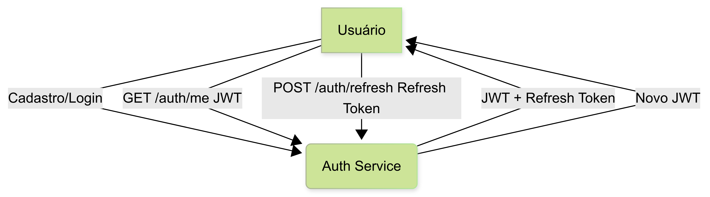

# Auth Service


Microserviço de autenticação e autorização para desenvolvedores, utilizando JWT e bcrypt.

---

## 🚀 Endpoints

| Método | Rota           | Descrição                        |
|--------|----------------|----------------------------------|
| POST   | /auth/register | Cadastro de novo usuário         |
| POST   | /auth/login    | Login e obtenção de tokens       |
| POST   | /auth/refresh  | Renovação do token JWT           |
| GET    | /auth/me       | Dados do usuário autenticado     |

> **Todos os endpoints retornam respostas em JSON.**

---

## 📊 Fluxo de Autenticação



1. O usuário se cadastra ou faz login e recebe um token JWT e um refresh token.
2. Utiliza o token JWT para acessar endpoints protegidos.
3. Quando o token expira, utiliza o refresh token para obter um novo JWT.

---

## 🎯 Funcionalidades
- Cadastro e login seguro de usuários
- Autenticação baseada em JWT
- Hash de senha com bcrypt
- Renovação de token (refresh)
- Consulta de dados do usuário autenticado

---

## 🗂️ Estrutura do Projeto

```
src/
  domain/         # Entidades e interfaces
  application/    # Casos de uso
  infrastructure/ # Repositórios, JWT, Prisma
  presentation/   # Controllers, rotas
```

---

## ⚙️ Como rodar localmente

1. Instale as dependências:
   ```sh
   npm install
   ```
2. Configure o banco de dados e variáveis JWT no arquivo `.env`
3. Rode as migrations:
   ```sh
   npx prisma migrate dev
   ```
4. Inicie o serviço:
   ```sh
   npm run dev
   ```

---

## 🐳 Subindo com Docker

1. Certifique-se de ter o Docker instalado.
2. Configure o arquivo `.env` conforme necessário.
3. Execute o comando:
   ```sh
   docker-compose up -d
   ```
4. O serviço estará disponível em `http://localhost:4001` (por padrão).

---

## 🧩 Dependências

Este microserviço pode ser utilizado de forma independente, mas normalmente integra-se com:

- **API Gateway**: Roteamento centralizado das requisições (porta padrão: 4000)
- **Scrum Service**: Consome autenticação para proteger endpoints de tarefas, cerimônias, etc (porta padrão: 4002)
- **Report Service**: Consome autenticação para proteger endpoints de relatórios (porta padrão: 4003)

---

## 🧪 Testando com Postman

- Utilize a collection [postman-collection.json](./postman-collection.json) disponível neste diretório.
- Preencha as variáveis `token` e `refreshToken` para testar todos os fluxos.

---

## 📚 Exemplos de Requisição

### Cadastro
```http
POST /auth/register
Content-Type: application/json
{
  "name": "Usuário Teste",
  "email": "usuario@email.com",
  "password": "123456"
}
```

### Login
```http
POST /auth/login
Content-Type: application/json
{
  "email": "usuario@email.com",
  "password": "123456"
}
```

### Renovação de Token
```http
POST /auth/refresh
Content-Type: application/json
{
  "refreshToken": "<refreshToken>"
}
```

### Dados do Usuário Autenticado
```http
GET /auth/me
Authorization: Bearer <token>
```

---

## 📝 Observações
- O serviço utiliza autenticação JWT e hash de senha com bcrypt.
- O refresh token deve ser armazenado de forma segura pelo cliente.
- Em caso de erro de autenticação, o serviço retorna status 401 ou 400.

---

## 👨‍💻 Contribuição
Pull requests são bem-vindos!

---

## 📄 Licença
MIT
