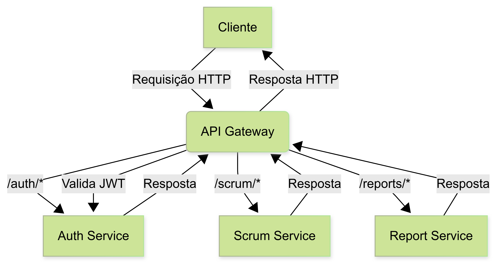

# API Gateway


Gateway responsável pelo roteamento centralizado das requisições entre os microserviços do sistema.

---

## 🚀 Rotas Proxy

| Caminho        | Destino (serviço)   | Porta padrão |
|----------------|---------------------|--------------|
| /auth/*        | Auth Service        | 4001         |
| /scrum/*       | Scrum Service       | 4002         |
| /reports/*     | Report Service      | 4003         |

> **Todas as rotas (exceto /auth) exigem autenticação via Bearer Token.**

---

## 📊 Fluxo de Requisições



1. O cliente faz requisições para o Gateway.
2. O Gateway valida o JWT (exceto para rotas /auth).
3. O Gateway encaminha a requisição para o microserviço correspondente.
4. O Gateway retorna a resposta do microserviço ao cliente.

---

## 🎯 Funcionalidades
- Roteamento centralizado para todos os microserviços
- Validação de autenticação JWT
- Suporte a CORS
- Facilidade de integração para frontends e ferramentas externas

---

## ⚙️ Como rodar localmente

1. Instale as dependências:
   ```sh
   npm install
   ```
2. Configure as variáveis de ambiente no arquivo `.env` (URLs dos microserviços, JWT_SECRET, etc)
3. Inicie o gateway:
   ```sh
   npm run dev
   ```

---

## 🐳 Subindo com Docker

1. Certifique-se de ter o Docker instalado.
2. Configure o arquivo `.env` conforme necessário.
3. Execute o comando:
   ```sh
   docker-compose up -d
   ```
4. O gateway estará disponível em `http://localhost:4000` (por padrão).

---

## 🧩 Microserviços Integrados

- **Auth Service**: Autenticação e autorização dos usuários (porta padrão: 4001)
- **Scrum Service**: Gerenciamento de tarefas, cerimônias, sprints, etc (porta padrão: 4002)
- **Report Service**: Geração de relatórios (porta padrão: 4003)

---

## 🧪 Testando com Postman

- Utilize a collection [postman-collection.json](./postman-collection.json) disponível neste diretório.
- Preencha as variáveis `token` e `userId` para testar todos os fluxos.

---

## 📝 Observações
- O Gateway não implementa lógica de negócio, apenas roteamento e autenticação.
- Para adicionar novos microserviços, basta configurar novas rotas proxy.
- Em caso de erro de autenticação, o gateway retorna status 401.

---

## 👨‍💻 Contribuição
Pull requests são bem-vindos!

---

## 📄 Licença
MIT
