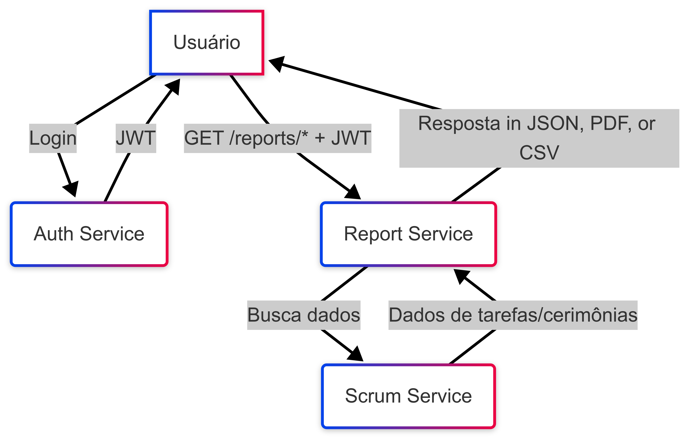

# Report Service


Microserviço responsável pela geração de relatórios personalizados sobre o tempo gasto em tarefas, cerimônias e outras atividades do Scrum.

---

## 🚀 Endpoints

| Método | Rota                       | Descrição                        |
|--------|----------------------------|----------------------------------|
| GET    | /reports/tasks             | Relatório de tarefas             |
| GET    | /reports/ceremonies        | Relatório de cerimônias          |
| GET    | /reports/summary           | Resumo geral                     |
| GET    | /reports/export            | Exporta relatório (PDF/CSV)      |

> **Todos os endpoints exigem autenticação via Bearer Token.**

---

## 📊 Fluxo de Uso



1. O usuário faz login e obtém um token JWT do Auth Service.
2. Realiza requisições autenticadas para os endpoints de relatório.
3. O Report Service consulta o Scrum Service para obter dados.
4. O usuário recebe os dados ou arquivos exportados conforme o endpoint.

---

## 🎯 Funcionalidades
- Filtragem por período, categoria, projeto e usuário
- Exportação em PDF/CSV
- Métricas e gráficos

---

## 🗂️ Estrutura do Projeto

```
src/
  domain/         # Entidades e interfaces
  application/    # Casos de uso
  infrastructure/ # Repositórios, Prisma
  presentation/   # Controllers, rotas
```

---

## ⚙️ Como rodar localmente

1. Instale as dependências:
   ```sh
   npm install
   ```
2. Configure o banco de dados no arquivo `.env`
3. Rode as migrations:
   ```sh
   npx prisma migrate dev
   ```
4. Inicie o serviço:
   ```sh
   npm run dev
   ```

---

## 🧩 Dependências

Este microserviço depende dos seguintes serviços para funcionamento completo:

- **Auth Service**: Autenticação e autorização dos usuários (porta padrão: 4001)
- **Scrum Service**: Fornece dados de tarefas, cerimônias, sprints, etc (porta padrão: 4002)
- **API Gateway**: Roteamento centralizado das requisições (porta padrão: 4000)

Certifique-se de que esses serviços estejam rodando para obter todos os dados necessários.

---

## 🧪 Testando com Postman

- Utilize a collection [postman-collection.json](./postman-collection.json) disponível neste diretório.
- Preencha as variáveis `token` (JWT) e `userId` para testar os endpoints.

---

## 📚 Exemplos de Requisição

### Relatório de Tarefas
```http
GET /reports/tasks?userId=123&year=2025&number=2
Authorization: Bearer <token>
```

### Exportar PDF
```http
GET /reports/export?userId=123&type=summary&format=pdf&year=2025&number=2
Authorization: Bearer <token>
```

---

## 📝 Observações
- O serviço depende de autenticação JWT.
- Para exportação, utilize os formatos `pdf` ou `csv` no parâmetro `format`.
- Em caso de erro de formato, consulte `/reports/error/unsupported-format`.

---

## 👨‍💻 Contribuição
Pull requests são bem-vindos!

---

## 📄 Licença
MIT
