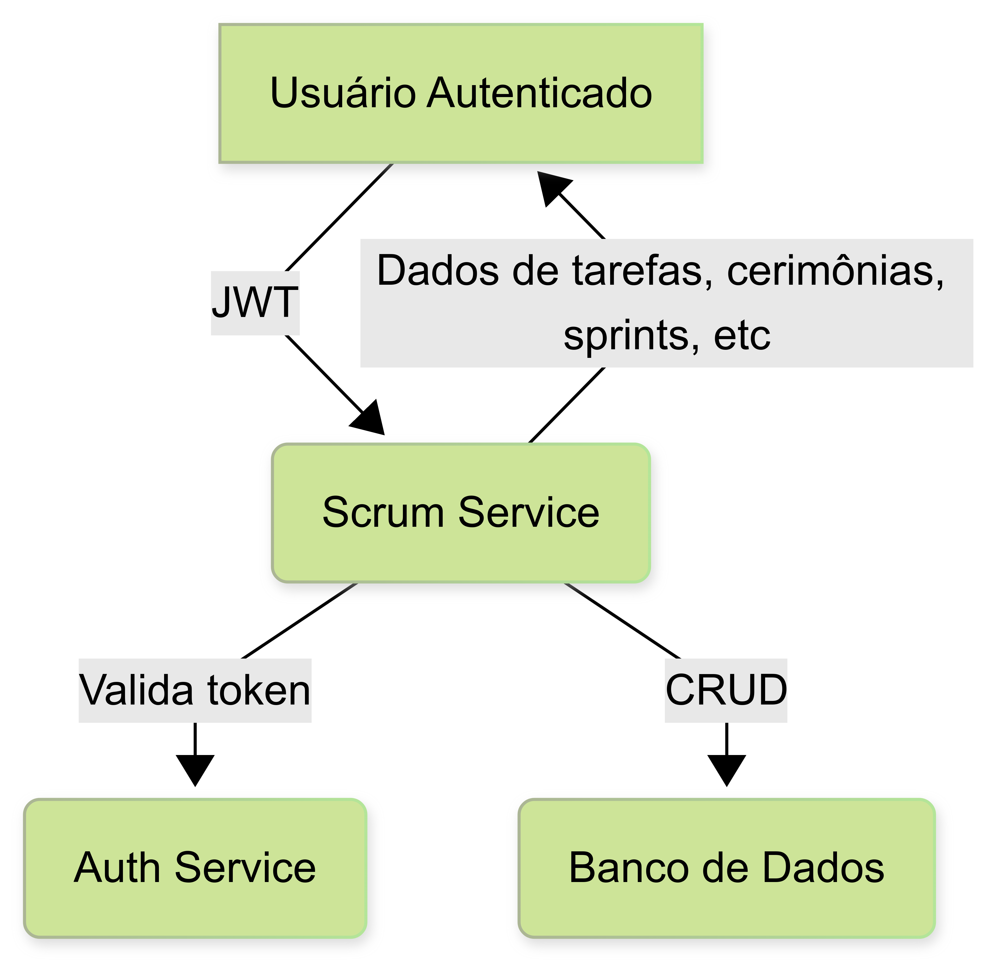

# Scrum Service


Microserviço responsável pelo gerenciamento de tarefas, cerimônias, sprints, trimestres e user stories do Scrum.

---

## 🚀 Endpoints Principais

| Método | Rota             | Descrição                        |
|--------|------------------|----------------------------------|
| GET    | /ceremonies      | Lista todas as cerimônias        |
| POST   | /ceremonies      | Cria uma nova cerimônia          |
| GET    | /tasks           | Lista todas as tasks             |
| POST   | /tasks           | Cria uma nova task               |
| GET    | /sprints         | Lista todos os sprints           |
| POST   | /sprints         | Cria um novo sprint              |
| GET    | /trimesters      | Lista todos os trimestres        |
| POST   | /trimesters      | Cria um novo trimestre           |
| GET    | /user-stories    | Lista todos os user stories      |
| POST   | /user-stories    | Cria um novo user story          |

> **Todos os endpoints protegidos exigem autenticação via Bearer Token.**

---

## 📊 Fluxo de Operação



1. O usuário autenticado faz requisições para o Scrum Service usando JWT.
2. O Scrum Service valida o token junto ao Auth Service.
3. O serviço executa operações de CRUD no banco de dados.
4. O usuário recebe os dados ou confirmações das operações.
5. O Scrum Service pode notificar outros serviços, como o Report Service, quando necessário.

---

## 🎯 Funcionalidades
- Gerenciamento de tarefas, cerimônias, sprints, trimestres e user stories
- Associação de registros de tempo e participantes
- Integração com Auth Service para autenticação

---

## 🗂️ Estrutura do Projeto

```
src/
  domain/         # Entidades e interfaces
  application/    # Casos de uso
  infrastructure/ # Repositórios, Prisma
  presentation/   # Controllers, rotas
```

---

## ⚙️ Como rodar localmente

1. Instale as dependências:
   ```sh
   npm install
   ```
2. Configure o banco de dados e variáveis JWT no arquivo `.env`
3. Rode as migrations:
   ```sh
   npx prisma migrate dev
   ```
4. Inicie o serviço:
   ```sh
   npm run dev
   ```

---

## 🐳 Subindo com Docker

1. Certifique-se de ter o Docker instalado.
2. Configure o arquivo `.env` conforme necessário.
3. Execute o comando:
   ```sh
   docker-compose up -d
   ```
4. O serviço estará disponível em `http://localhost:4002` (por padrão).

---

## 🧩 Dependências

- **Auth Service**: Para autenticação e autorização dos usuários (porta padrão: 4001)
- **API Gateway**: Roteamento centralizado das requisições (porta padrão: 4000)
- **Report Service**: Pode consumir dados do Scrum Service para relatórios (porta padrão: 4003)

---

## 🧪 Testando com Postman

- Utilize a collection [postman-collection.json](./postman-collection.json) disponível neste diretório.
- Preencha a variável `token` para testar os fluxos protegidos.

---

## 📚 Exemplos de Requisição

### Listar Cerimônias
```http
GET /ceremonies
Authorization: Bearer <token>
```

### Criar Task
```http
POST /tasks
Authorization: Bearer <token>
Content-Type: application/json
{
  "title": "Implementar endpoint",
  "description": "Criar endpoint de exemplo"
}
```

---

## 📝 Observações
- O serviço exige autenticação JWT para todas as operações protegidas.
- Em caso de erro de autenticação, o serviço retorna status 401 ou 400.

---

## 👨‍💻 Contribuição
Pull requests são bem-vindos!

---

## 📄 Licença
MIT
