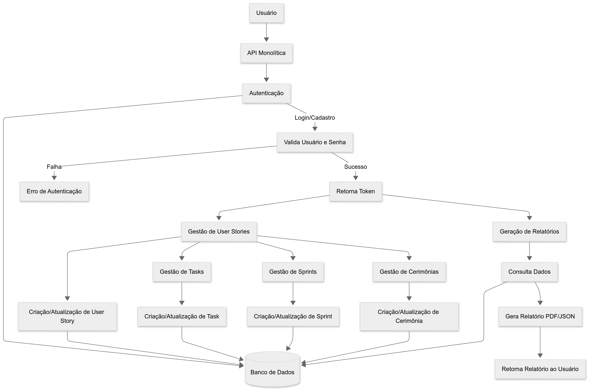

# Monolithic API


API unificada que centraliza autenticação, gestão de Scrum e relatórios, integrando toda a lógica dos microserviços em um único serviço.

---

## 🚦 Endpoints Principais

### Auth

| Método | Rota           | Descrição                        |
|--------|----------------|----------------------------------|
| POST   | /auth/register | Cadastro de novo usuário         |
| POST   | /auth/login    | Login e obtenção de tokens       |
| POST   | /auth/refresh  | Renovação do token JWT           |
| GET    | /auth/me       | Dados do usuário autenticado     |

### Scrum

| Método | Rota                | Descrição                        |
|--------|---------------------|----------------------------------|
| GET    | /scrum/ceremonies   | Lista todas as cerimônias        |
| POST   | /scrum/ceremonies   | Cria uma nova cerimônia          |
| GET    | /scrum/tasks        | Lista todas as tasks             |
| POST   | /scrum/tasks        | Cria uma nova task               |
| GET    | /scrum/sprints      | Lista todos os sprints           |
| POST   | /scrum/sprints      | Cria um novo sprint              |
| GET    | /scrum/trimesters   | Lista todos os trimestres        |
| POST   | /scrum/trimesters   | Cria um novo trimestre           |
| GET    | /scrum/user-stories | Lista todos os user stories      |
| POST   | /scrum/user-stories | Cria um novo user story          |

### Reports

| Método | Rota                  | Descrição                   |
|--------|-----------------------|-----------------------------|
| GET    | /reports/tasks        | Relatório de tarefas        |
| GET    | /reports/ceremonies   | Relatório de cerimônias     |
| GET    | /reports/summary      | Resumo geral                |
| GET    | /reports/export       | Exporta relatório (PDF/CSV) |

> **Todos os endpoints (exceto /auth) exigem autenticação via Bearer Token.**

---

## 🧩 Estrutura do Projeto

```
api/
  monolithic/
    src/
      application/
      domain/
      infrastructure/
      presentation/
    prisma/
      schema.prisma
      migrations/
```

---

## 🔄 Fluxos




### Autenticação

1. O usuário se cadastra ou faz login e recebe um token JWT e um refresh token.
2. Utiliza o token JWT para acessar endpoints protegidos.
3. Quando o token expira, utiliza o refresh token para obter um novo JWT.

### Operações Scrum

1. O usuário autenticado faz requisições para endpoints de Scrum.
2. O monolito valida o token e executa operações de CRUD no banco de dados.
3. O usuário recebe os dados ou confirmações das operações.

### Relatórios

1. O usuário faz login e obtém um token JWT.
2. Realiza requisições autenticadas para os endpoints de relatório.
3. O monolito processa e retorna os dados ou arquivos exportados.

---

## 🎯 Funcionalidades

- Cadastro, login e autenticação JWT
- Gestão de tarefas, user stories, sprints, trimestres e cerimônias
- Relatórios customizados e exportação em PDF/CSV
- Estrutura modular e escalável

---

## ▶️ Como rodar localmente

1. Instale as dependências:
   ```sh
   cd api/monolithic
   npm install
   ```
2. Execute as migrações do banco:
   ```sh
   npx prisma migrate dev
   ```
3. Rode a API:
   ```sh
   npm run dev
   ```
4. Acesse: [http://localhost:4010](http://localhost:4010)

---
